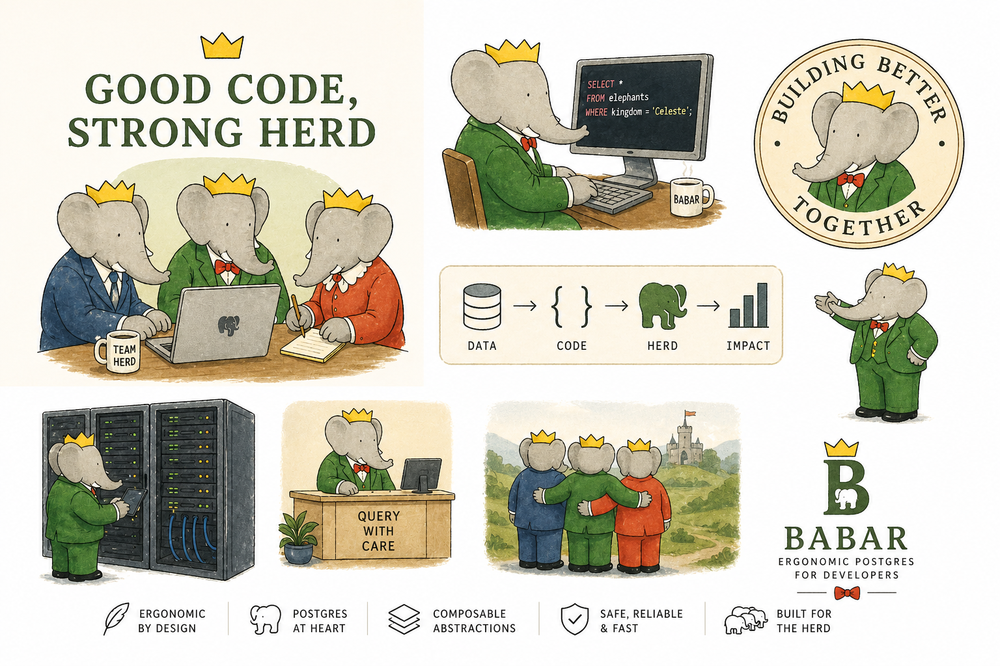

# The Book of Babar

Typed Postgres for Rust, built directly on Tokio and the PostgreSQL wire
protocol.



`babar` gives you a small set of Postgres-shaped building blocks:

- `Config` describes how to connect.
- `Session` owns one connection and a background driver task.
- `query!` and `command!` define typed SQL from authored schema facts.
- `Query::raw`, `Query::raw_with`, `Command::raw`, and `Command::raw_with`
  stay available when you need an explicit fallback.

```text
cargo add babar
```

## One typed-SQL path

The primary application story is:

1. author schema facts with `schema!`
2. build statements with schema-scoped `query!` / `command!`
3. pass Rust values that already match the SQL shape

```rust
use babar::query::{Command, Query};
use babar::{Config, Session};

#[derive(Debug, Clone, PartialEq, babar::Codec)]
struct NewDemoUser {
    id: i32,
    name: String,
}

#[derive(Debug, Clone, PartialEq, babar::Codec)]
struct DemoUser {
    id: i32,
    name: String,
}

babar::schema! {
    mod app_schema {
        table demo_users {
            id: primary_key(int4),
            name: text,
        }
    }
}

#[tokio::main(flavor = "current_thread")]
async fn main() -> babar::Result<()> {
    let session: Session = Session::connect(
        Config::new("localhost", 5432, "postgres", "postgres")
            .password("secret")
            .application_name("hello-babar"),
    )
    .await?;

    let create: Command<()> =
        Command::raw("CREATE TEMP TABLE demo_users (id int4 PRIMARY KEY, name text NOT NULL)");
    session.execute(&create, ()).await?;

    let insert: Command<NewDemoUser> =
        app_schema::command!(INSERT INTO demo_users (id, name) VALUES ($id, $name));
    session
        .execute(
            &insert,
            NewDemoUser {
                id: 1,
                name: "Ada".to_string(),
            },
        )
        .await?;

    let select: Query<(), DemoUser> = app_schema::query!(
        SELECT demo_users.id, demo_users.name
        FROM demo_users
        ORDER BY demo_users.id
    );

    let rows: Vec<DemoUser> = session.query(&select, ()).await?;
    for row in &rows {
        println!("{}	{}", row.id, row.name);
    }

    session.close().await?;
    Ok(())
}
```

That example shows the intended split:

- schema-aware macros for application SQL
- explicit raw fallbacks for bootstrap or unsupported statements
- structs as the normal shape for application-facing rows and parameters

## Choose your path

- **[Product docs path](getting-started/prerequisites.md)** — the direct route for
  readers who want to connect, query, and ship with `babar`.
- **[Rust learning track](rust-learning/index.md)** — an optional guided path for
  readers who want to learn Rust concepts through `babar` examples.

## Rust learning track (optional)

The Rust learning track is a separate top-level section in the book navigation.
Use it if you want a guided Rust-first tour through `babar`. Skip it if you
already know Rust or just want the fastest route into the product docs. Start at
[Learn Rust with babar](rust-learning/index.md) when you want that companion path.

## How the docs are organized

- **[Get Started](getting-started/first-query.md)** teaches the first successful round-trip.
- **[The Book](book/01-connecting.md)** walks feature-by-feature through everyday usage.
- **[Explanation](explanation/what-makes-babar-babar.md)** covers architecture, design,
  and trade-offs.
- **[Reference](reference/codecs.md)** is the catalog for codecs, errors, features,
  and configuration.

## Where to go next

- **[Prerequisites →](getting-started/prerequisites.md)** — start a local Postgres and
  make the examples observable.
- **[Your first query →](getting-started/first-query.md)** — connect, create a table,
  insert a row, and read it back.
- **[Rust learning track →](rust-learning/index.md)** — take the optional guided route
  if you want to learn Rust through `babar`.
- **[Selecting rows →](book/02-selecting.md)** — learn the standard query shape with
  schema-scoped wrappers and row structs.
- **[What makes babar babar →](explanation/what-makes-babar-babar.md)** — see how the
  driver task, typed boundaries, and Postgres-specific design fit together.
- **[The typed-SQL macro pipeline →](explanation/typed-sql-macro-pipeline.md)** — follow
  `schema!`, `query!`, and `command!` from authored schema facts to runtime values.
